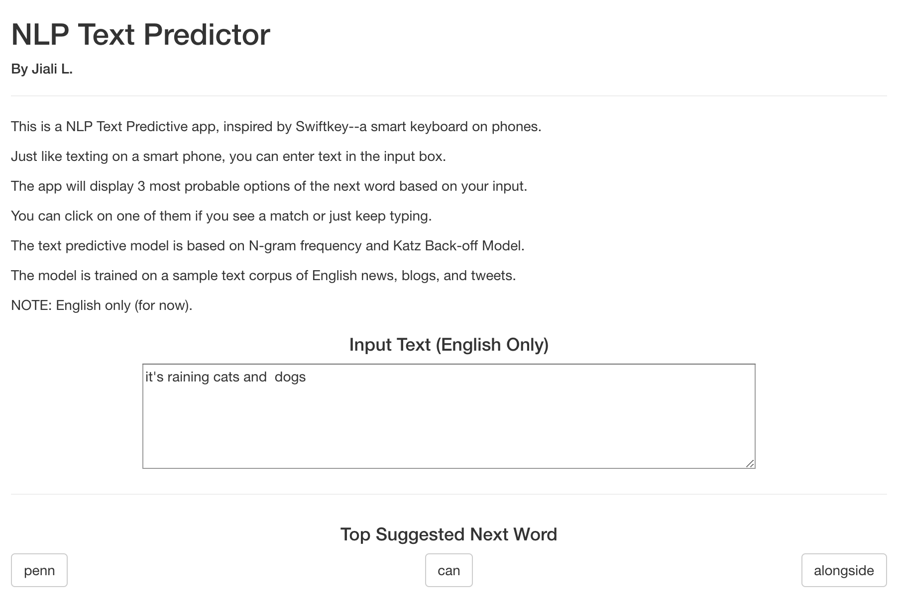
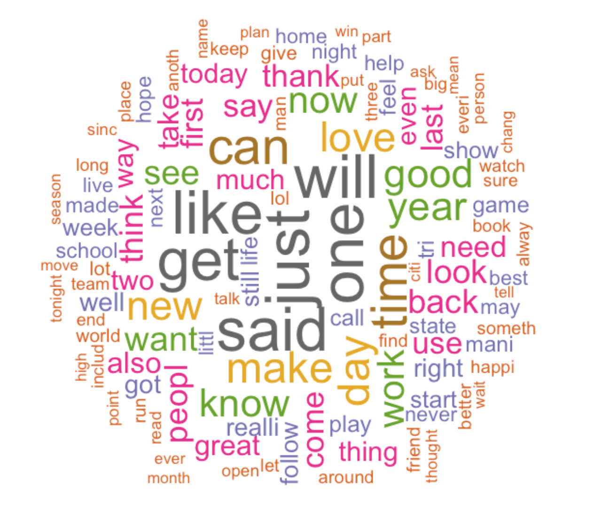

NLP Text Predictive Model
========================================================
author: Jiali L.
date: July 31st, 2020
autosize: true

Background
========================================================

A smart keyboard can make typing on mobile devices easier in our daily lives, and Swiftkey is one of the companies developing such technology using natural language processing (NLP) and text predictive models.

The goal of the project is to explore NLP for text predictive models and to build a Shiny App to showcase it.

Shiny App: Layout
========================================================

Shiny App: Behind the Scene
========================================================

- The data can be found here: [dataset](https://d396qusza40orc.cloudfront.net/dsscapstone/dataset/Coursera-SwiftKey.zip)
- The data used for the text predictive model is English text collected from news, blogs, and tweets.
- 5% of the text is sampled and built into **n-gram** frequency table for this app.
- N-gram used for the app include 1- through 4-gram.
- The wordcloud below shows the top 300 frequent words (1-gram) from the data.

Shiny App: Behind the Scene (cont)
========================================================

- "Stupid"/ Katz's Back-off Algorithm is applied.
- It starts with 4-gram (quadgram) by matching the last 3 words from user input text and outputting the 4th word if there's a match.
- If no match found in 4-gram, then proceed to 3-gram (trigram) to match the last 2 words from user input and output the 3rd word as a predicted text.
- Similarly, go through 2-gram (bigram) to match the last word and output the 2nd word.
- In the end, aggregate all the findings and output the top 3 results (based on frequency).

More Information
========================================================

The app can be accessed here:

[https://jiali-lei.shinyapps.io/nlp_text_predict_app/](https://jiali-lei.shinyapps.io/nlp_text_predict_app/)

The entire project (including data, exploratory analysis, predictive models, and shiny app) can be found here:

[https://github.com/jiali-lei/DataScienceCoursera/tree/master/Capstone](https://github.com/jiali-lei/DataScienceCoursera/tree/master/Capstone)
