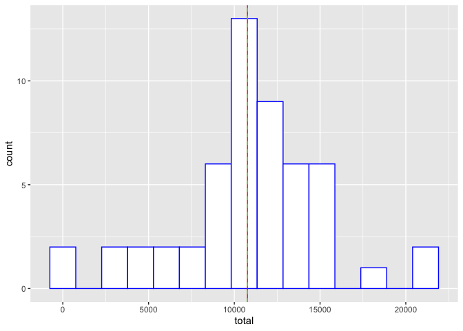
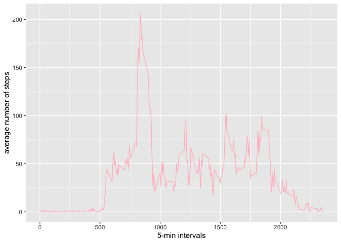
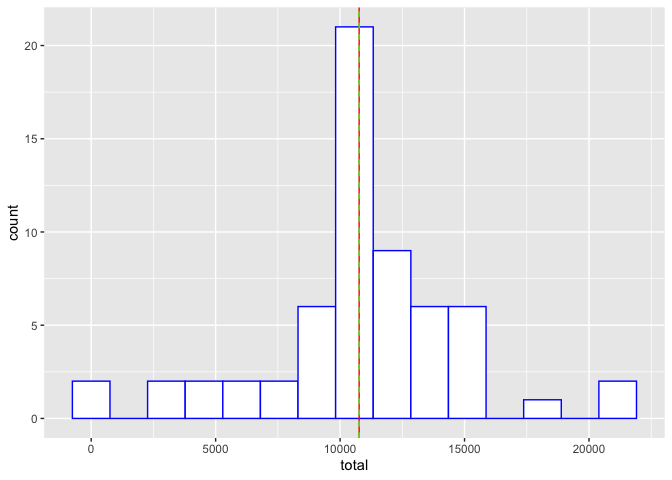
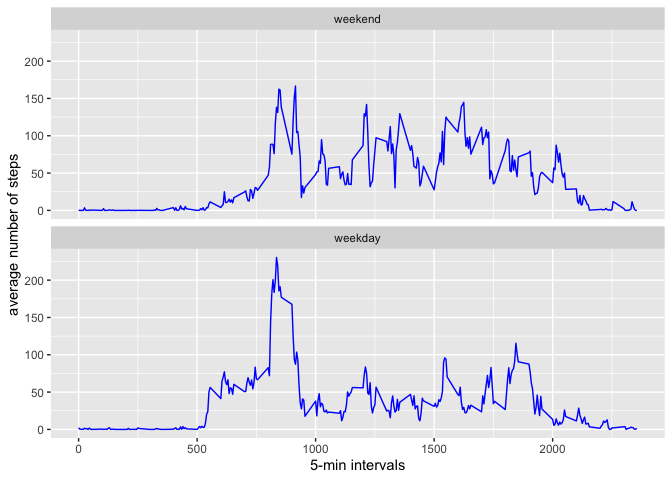

Course Project 1
========================================

## Introduction

It is now possible to collect a large amount of data about personal movement using activity monitoring devices such as a [Fitbit](http://www.fitbit.com/), [Nike Fuelband](http://www.nike.com/us/en_us/c/nikeplus-fuelband), or [Jawbone Up](https://jawbone.com/up). These type of devices are part of the “quantified self” movement – a group of enthusiasts who take measurements about themselves regularly to improve their health, to find patterns in their behavior, or because they are tech geeks. But these data remain under-utilized both because the raw data are hard to obtain and there is a lack of statistical methods and software for processing and interpreting the data.

This assignment makes use of data from a personal activity monitoring device. This device collects data at 5 minute intervals through out the day. The data consists of two months of data from an anonymous individual collected during the months of October and November, 2012 and include the number of steps taken in 5 minute intervals each day.


## Data

- Dataset: [Activity monitoring data (52k)](https://d396qusza40orc.cloudfront.net/repdata%2Fdata%2Factivity.zip)

The variables include in this dataset are:

- **steps**: Number of steps taking in a 5-min intervals (missing values are coded as \(\color{red}{\text{NA}}\) 
- **date**: The date on which the measurement was taken in YYYY-MM-DD format
- **interval**: Identifier for the 5-min interval in which measurement was taken

The dataset is stored in a comma-separated-value (CSV) file and there are a total of 17,568 observations in this dataset.


## Assignment

This assignment will be described in multiple parts, including writing a report that answers the questions detailed below and complete the entire assignment in a **single R markdown** document that can be processed by **knitr** and be transformed into an HTML file.

Throughout the report, make sure to include the code used to generate the output presented. When writing code chunks in the R markdown document, always use \(\color{red}{\text{echo = TRUE}}\) so that someone else will be able to read the code. 

For the plotting aspects of this assignment, feel free to use any plotting system in R (i.e., base, lattice, ggplot2)

NOTE: The GitHub repository also contains the dataset for teh assignment so there's no need to download the data separately.


## Loading and preprocessing the data


```r
unzip("activity.zip")
actdata <- read.csv("activity.csv")
str(actdata)
```

```
## 'data.frame':	17568 obs. of  3 variables:
##  $ steps   : int  NA NA NA NA NA NA NA NA NA NA ...
##  $ date    : Factor w/ 61 levels "2012-10-01","2012-10-02",..: 1 1 1 1 1 1 1 1 1 1 ...
##  $ interval: int  0 5 10 15 20 25 30 35 40 45 ...
```

```r
## convert 'date' to a date format
actdata$date <- as.Date(as.character(actdata$date))
head(actdata,3)
```

```
##   steps       date interval
## 1    NA 2012-10-01        0
## 2    NA 2012-10-01        5
## 3    NA 2012-10-01       10
```


## What is mean total number of steps taken per day?

1. Calculate the total number of steps taken per day


```r
library(dplyr)
```

```
## 
## Attaching package: 'dplyr'
```

```
## The following objects are masked from 'package:stats':
## 
##     filter, lag
```

```
## The following objects are masked from 'package:base':
## 
##     intersect, setdiff, setequal, union
```

```r
library(tidyr)
actdaysum <- actdata %>% 
        group_by(date) %>%
        drop_na(steps) %>%
        summarise(total = sum(steps))
head(actdaysum, 3)
```

```
## # A tibble: 3 x 2
##   date       total
##   <date>     <int>
## 1 2012-10-02   126
## 2 2012-10-03 11352
## 3 2012-10-04 12116
```

2. Make a histogram of the total number of steps taken each day


```r
library(ggplot2)
g <- ggplot(actdaysum, aes(total))
g + 
  geom_histogram(color="blue", fill="white", bins=15) +
  geom_vline(xintercept = mean(actdaysum$total), color="red", linetype="solid") +
  geom_vline(xintercept = median(actdaysum$total), color="green", linetype="dashed")
```

<!-- -->

3. Calculate and report the mean and median of the total number of steps taken per day


```r
summary(actdaysum)
```

```
##       date                total      
##  Min.   :2012-10-02   Min.   :   41  
##  1st Qu.:2012-10-16   1st Qu.: 8841  
##  Median :2012-10-29   Median :10765  
##  Mean   :2012-10-30   Mean   :10766  
##  3rd Qu.:2012-11-16   3rd Qu.:13294  
##  Max.   :2012-11-29   Max.   :21194
```


## What is the average daily activity pattern?

1. Make a time series plot (i.e. \(\color{red}{\text{type = "l"}}\)) of the 5-min interval (x-axis) and the average number of steps taken, averaged across all days (y-axis)


```r
actinterval <- actdata %>%
  group_by(interval) %>%
  drop_na(steps) %>%
  summarise(average = mean(steps))

p <- ggplot(actinterval, aes(interval, average))
p + 
  geom_line(color="pink") +
  labs(x="5-min intervals", y="average number of steps")
```

<!-- -->

2. Which 5-min interval, on average across all the days in the dataset, contains the maximum number of steps?


```r
max5 <- actinterval$interval[which.max(actinterval$average)]
max5
```

```
## [1] 835
```


## Imputing missing values

1. Calculate and report the total number of missing values in the dataset


```r
s <- sum(is.na(actdata$steps))
s
```

```
## [1] 2304
```

```r
sportion <- s/length(actdata$steps)
sportion
```

```
## [1] 0.1311475
```

2. The strategy for filling in all the missing values in the dataset is to replace the NAs with the mean for the respective 5-min interval

3. Create a new dataset that is equal to the original dataset but with the missing data filled in


```r
mrg <- merge(actdata, actinterval, "interval", sort = FALSE)
new_actdata <- within(mrg, steps[is.na(steps)] <- average[is.na(steps)])
sum(is.na(new_actdata$steps))
```

```
## [1] 0
```

4. Make a histogram of the total number of steps taken each day and Calculate and report the **mean** and **median** total number of steps taken per day. Do these values differ from the estimates from the first part of the assignment? What is the impact of imputing missing data on the estimates of the total daily number of steps?


```r
new_actdaysum <- new_actdata %>% 
  group_by(date) %>% 
  drop_na(steps) %>% 
  summarise(total = sum(steps))

q <- ggplot(new_actdaysum, aes(total))
q + 
  geom_histogram(color="blue", fill="white", bins=15) +
  geom_vline(xintercept = mean(actdaysum$total), color="red", linetype="solid") +
  geom_vline(xintercept = median(actdaysum$total), color="green", linetype="dashed")
```

<!-- -->

```r
summary(new_actdaysum$total)
```

```
##    Min. 1st Qu.  Median    Mean 3rd Qu.    Max. 
##      41    9819   10766   10766   12811   21194
```

```r
print(paste("The difference of mean total number of steps taken daily between pre- and post-imputing is ", as.character(mean(actdaysum$total)-mean(new_actdaysum$total))))
```

```
## [1] "The difference of mean total number of steps taken daily between pre- and post-imputing is  0"
```

```r
print(paste("The difference of median total number of steps taken daily between pre- and post-imputing is ", as.character(median(actdaysum$total)-median(new_actdaysum$total))))
```

```
## [1] "The difference of median total number of steps taken daily between pre- and post-imputing is  -1.1886792452824"
```


## Are there differences in activity patterns between weekdays and weekends?

1. Create a new factor variable in the dataset with two levels - "weekday" and "weekend" indicating whether a given date is a weekday or weekend day.


```r
## Create a vector of weekdays
weekdays1 <- c('Monday', 'Tuesday', 'Wednesday', 'Thursday', 'Friday')
## Use `%in%` and `weekdays` to create a logical vector convert to `factor` and specify the `levels/labels`
new_actdata$wDay <- factor((weekdays(new_actdata$date) %in% weekdays1), 
                   levels=c(FALSE, TRUE), 
                   labels=c('weekend', 'weekday')) 
```

2. Make a panel plot containing a time series plot (i.e. \(\color{red}{\text{type = "l"}}\)) of the 5-min interval (x-axis) and the average number of steps taken, averaged across all weekday days or weekend days (y-axis).


```r
new_actint <- new_actdata %>%
  group_by(wDay, interval) %>%
  summarise(average = mean(steps))
pq <- ggplot(new_actint, aes(interval, average))
pq + 
  geom_line(color="blue") +
  facet_wrap(~wDay, nrow=2, ncol=1) +
  labs(x="5-min intervals", y="average number of steps")
```

<!-- -->

