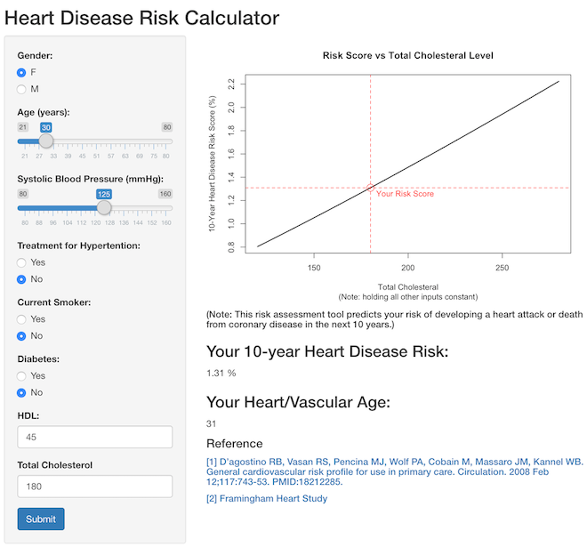

## Heart Disease Risk Calculator

- This risk calculator uses information from the **Framingham Heart Study** to predict your risk of developing a heart attack or death from coronary disease in the next 10 years.
- The original study covers population of interest with individuals 30 to 74 years old and without cardiovascular diseases at the baseline examination. ( _NOTE: The app built with Shiny extrapolated the age to_ **21 to 80** _years old._)
- The **side panel** of the app asks for user inputs such as _gender, age, lipids info, diabetic or not, smoking status_
- The **main panel** shows a plot showing "Risk Score vs Total Cholesteral", the predicted 10-year heart attack risk score and its corresponding heart age.

## 
#### **Variables / Predictors**
- log(Age)
- log(Total Cholesteral)
- log(HDL Cholesteral)
- log(Systolic Blood Pressure)
- Smoker status
- Diabetes status  

#### **Formula**
- For women: $1-0.95012^{e^{(ΣßX – 26.1931)}}$ 
- For men: $1-0.88936^{e^{(ΣßX – 23.9802)}}$
- $ß$: regression coefficient from the Study
- $X$: variables/predictors above

## 

  

## References

[1. D’agostino RB, Vasan RS, Pencina MJ, Wolf PA, Cobain M, Massaro JM, Kannel WB. General cardiovascular risk profile for use in primary care. Circulation. 2008 Feb 12;117:743-53. PMID:18212285.](https://www.ahajournals.org/doi/10.1161/CIRCULATIONAHA.107.699579)  
[2. Framingham Heart Study](https://framinghamheartstudy.org/fhs-risk-functions/cardiovascular-disease-10-year-risk/#)
